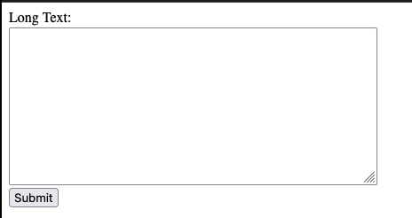

# Text Chunker

A Flask web application that helps process and chunk large texts for easier handling, especially when working with language models that have context length limitations.

## Features

- Clean and process input text by:
  - Removing URLs and email addresses
  - Stripping special characters
  - Removing common stopwords
- Split long texts into manageable chunks (default 30,000 characters)
- Display chunked text with copy functionality
- Simple and intuitive web interface

## How It Works

1. **Input**: Users paste their long text into a form
2. **Processing**: The application cleans and processes the text
3. **Chunking**: Long texts are split into manageable chunks
4. **Display**: Chunks are listed with links to view each separately
5. **Copying**: Each chunk can be copied to clipboard with a button click

## Code Structure

The application consists of several parts:

### Text Processing Functions

- `clean_text()`: Removes URLs, emails, and special characters
- `remove_stopwords()`: Filters out common English stopwords
- `chunk_text()`: Splits text into chunks of specified maximum length

### Flask Routes

- `/`: Main page with input form (handles both GET and POST requests)
- `/text/<text_id>`: Displays individual text chunks with copy functionality

### Data Storage

- Uses an in-memory dictionary (`chunked_text_cache`) for temporary storage of text chunks
- Each chunk is given a unique ID for retrieval

## Usage

1. Run the application
2. Open your browser to `http://localhost:8080`
3. Paste your long text into the form and submit
4. View the resulting chunks and use the "Copy to Clipboard" buttons as needed
5. Use the instructions provided to send text parts for context to language models

## Technical Details

- Built with Flask (Python web framework)
- Uses client-side JavaScript for clipboard functionality
- Designed to run in a Replit environment
- Chunks are stored in memory (not persistent across application restarts)

## Deployment

The application is configured to run on Replit's Cloud Run service with the following settings in `.replit`:
- Entry point: `main.py`
- Run command: `python3 main.py`
- Deployment target: `cloudrun`

## Dependencies

- Flask: Web framework
- Python 3.10+

All dependencies are managed through Poetry as specified in `pyproject.toml`.
